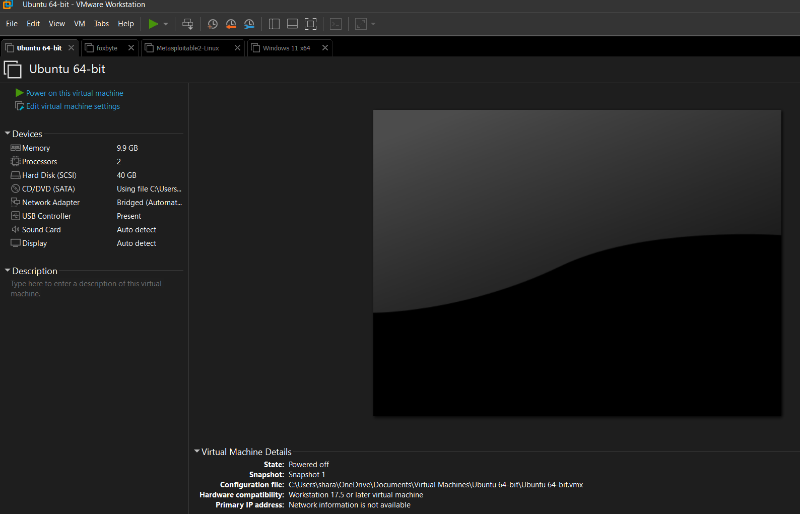
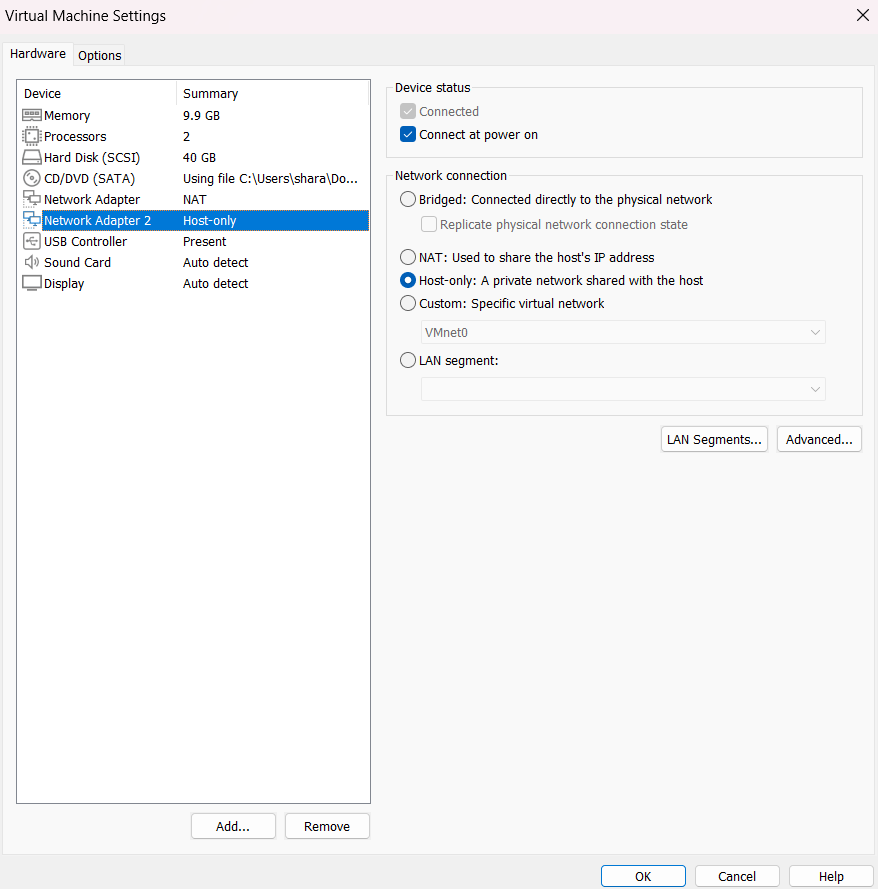
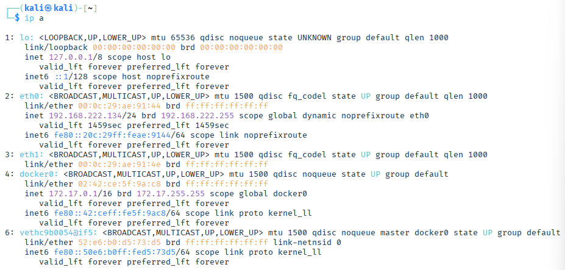
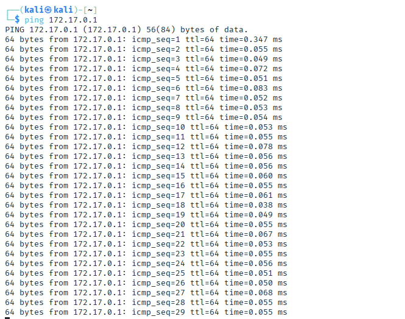

# CyberSecurity Lab
Personal cybersecurity lab (Kali + vulnerable web app) using VMware, NAT + Host-Only networks, with evidence screenshots.

This repository documents my isolated cybersecurity lab.
The lab uses VMware Workstation, Kali Linux as the attacker, and OWASP Juice Shop as the vulnerable web application, with NAT + Host-Only networking for isolation.

## 1. Lab Architecture

- Hypervisor: VMware Workstation
- Attacker: Kali Linux
- Target: OWASP Juice Shop (Docker on Kali / Ubuntu)
- Networks:
  - NAT: Internet access for updates
  - Host-Only: Isolated attacker–target traffic

  VMware virtual machine overview:

## 2. Kali Linux Attacker VM

Kali VM resources:
- 2 vCPUs
- 10 GB RAM
- 40 GB virtual disk

Kali is successfully booted and used as the main attacker machine.

Kali is successfully booted and used as the main attacker machine.

## 3. Network Configuration

### 3.1 VMware network adapters

Kali is configured with two adapters:
- Adapter 1: NAT – used to share the host’s IP for internet access
- Adapter 2: Host-Only – private network between host and lab VMs

The target VM is connected to the Host-Only network so it can communicate with Kali but not the external network.

### 3.2 Kali IP configuration

Inside Kali, `ip a` shows:
- `eth0` with a NAT IP (for internet)
- `eth1` with a Host-Only IP (for lab traffic)
- Docker bridge network used by Juice Shop

.

Kali can reach the Docker network:

`ping 172.17.0.1`

## 4. Vulnerable Target – OWASP Juice Shop
OWASP Juice Shop is deployed in Docker and exposed on port 3000.

Example commands used:

`sudo apt update`

`sudo apt install -y docker.io`

`sudo systemctl enable --now docker`

`sudo docker pull bkimminich/juice-shop`

`sudo docker run -d -p 3000:3000 --name juice bkimminich/juice-shop
`

From Kali’s browser the application is accessible at:
`
http://172.17.0.1:3000/
`

## 5. Connectivity Testing and Scanning
### 5.1 Basic connectivity
Kali is able to reach the lab addresses (NAT / Host-Only / Docker) using ICMP.

`
ping <target-ip>
`(Replace <target-ip> with your actual IP.)

### 5.2 Nmap scan
A simple host discovery scan is used to confirm the target is reachable:

`
nmap -sn <target-ip>
`

## 6. Burp Suite Validation
Burp Suite Community Edition is installed on Kali and used as an intercepting proxy.

Typical workflow:

1.Start Burp and create a temporary project.

2.Configure the browser proxy to 127.0.0.1:8080.

3.Browse to OWASP Juice Shop.

4.Inspect captured HTTP requests.

## 7. Wireshark Traffic Capture
Wireshark is used to capture traffic on the lab interface.

Steps:

1.Start Wireshark on Kali.

2.Select the interface that carries lab traffic.

3.Begin capture and browse the Juice Shop site.

4.Observe TCP/HTTP packets between attacker and target.

## 8. Summary

This lab demonstrates:

Creating and managing VMs in VMware Workstation

Using NAT and Host-Only networking for isolation

Deploying a vulnerable web application (OWASP Juice Shop) in Docker

Validating connectivity and services with ip a, ping, and Nmap

Observing and intercepting traffic with Wireshark and Burp Suite
